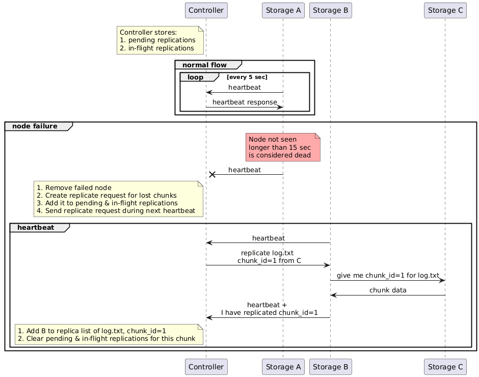
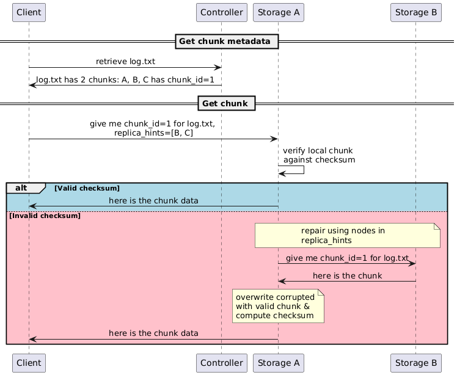

# How to test
- Steps to test logging using scripts 
    ```bash
    # Start Controller & Storage Nodes
    ./scripts/start.sh

    # If you want to log to the terminal use
    ./scripts/logs.sh

    # Stop the application
    ./scripts/stop.sh
    ```

- Client
    ```bash
    # Store file
    ./bin/client --controller <host:port> store --file <filepath>

    # Retrieve file
    ./bin/client --controller <host:port> retrieve --file <filename> --output <output_dir>

    # List file
    # TBD
    ```

# Design Flow

## Replication flow


1. The Controller manages two replication-tracking structures:
    - `pendingReplications`: replication requests that have been queued and will be sent to destination nodes on the next heartbeat response.
    - `inFlightReplications`: chunk replications that have already been assigned to a destination node but have not yet been confirmed. This includes both:
        - requests still waiting in `pendingReplications`
        - requests that were already sent, but the destination node has not yet acknowledged success
2. Every 5 seconds, the Controller checks whether storage nodes are still alive by tracking incoming `Heartbeat` messages.
    - If a node has not been seen within `HeartbeatTimeout` (15 seconds), the Controller marks it as failed.
    - At that point, the Controller:
        - removes the failed node from the live node set
        - re-queues any unconfirmed replications that were assigned to that failed node as a destination
        - handles the failed node’s confirmed chunk replicas by scheduling re-replication
3. To handle node failure, the Controller:
    - finds all chunks whose confirmed replica list included the failed node
    - for each affected chunk, queues replication:
        - removes the failed node from the chunk’s confirmed replica list
        - checks whether the chunk already has an assigned-but-unconfirmed replication in `inFlightReplications`
        - if so, it does not issue another replication request
        - otherwise, it:
            - picks a source node from the surviving confirmed replicas
            - picks a destination node that does not already hold a confirmed copy of the chunk
            - creates a `ReplicateRequest`
            - adds that request to `pendingReplications`
            - records the chunk in `inFlightReplications`
    - At this stage, the destination node is not yet added to the chunk’s confirmed replica list.
4. The Controller sends queued replication work during the next heartbeat cycle.
    - When a destination node sends a `Heartbeat`, the Controller responds with a `HeartbeatResponse`.
    - If there are queued replication requests for that destination node, they are piggybacked in that `HeartbeatResponse`.
    - After sending them, the requests are removed from `pendingReplications`, but they remain tracked in `inFlightReplications` until success is confirmed.
5. The destination storage node handles a ReplicateRequest as follows:
    - It first tries to fetch a verified copy of the chunk from the suggested source node.
    - If that source cannot provide a valid copy, for example because the node is down or its local replica is corrupted, the destination node asks the Controller for refreshed chunk holders using `ChunkLocationsRequest`.
    - It then tries candidate replicas one at a time using RepairChunkRequest.
    - Once it gets a valid copy, it writes: the chunk file & the recomputed checksum sidecar.
    - It then records the chunk in newChunks, so the next Heartbeat will report that it now holds the chunk.
6. The destination storage node acknowledges successful replication indirectly through its next `Heartbeat`. The `Heartbeat` includes the replicated chunk in `new_chunks` field.
7. In `handleHeartbeat()`, the Controller processes these reported chunks:
    - If the reporting node was the expected destination for an unconfirmed replication of that chunk, the Controller:
        - adds the node to the chunk’s confirmed replica list
        - clears the corresponding entry in inFlightReplications
    - This is the point where replication becomes confirmed in controller metadata.
8. If a destination node fails before confirming replication:
    - the failure detector removes it from the live node set
    - any unconfirmed replications assigned to that node are removed from `inFlightReplications`
    - those chunks can then be queued again for replication to a different destination node

## Corruption Detection flow


1. Client sends `RetrieveRequest` to the Controller with the filename.
2. Controller sends a list of chunks + nodes that have a copy of each chunk (`RetrieveResponse`)
3. Client fetches chunks in parallel. For each chunk, it sends `RetrieveChunkRequest` to one storage node. The request includes:
    - `ChunkInfo` (`filename`, `chunk_index`)
    - `replica_hints`, which are the other nodes known to hold replicas of that chunk
4. The contacted storage node verifies its local chunk against the checksum sidecar stored on disk.
    - If the local copy is valid, it returns the chunk immediately.
    - If the local copy is corrupted, it tries to repair using the nodes in `replica_hints`.
    - If those hints fail, for example because nodes are down or the list is stale, it sends `ChunkLocationsRequest` to the Controller to get a refreshed list of holders for that chunk.
    - The storage node then sends `RepairChunkRequest` to candidate replicas one at a time.
    - A replica that receives `RepairChunkRequest` only checks its own local chunk against its own local checksum.
    - If valid, it returns the chunk in `RepairChunkResponse`.
    - If invalid or missing, it returns failure immediately.
    - Importantly, a replica does not start another repair attempt from inside `RepairChunkRequest`, because that would create repair chains or loops, make latency unpredictable, and allow one client read to trigger a cascade of cross-node recovery work.
5. Once the original storage node gets a valid chunk from a replica, it overwrites its corrupted local copy and recomputes the checksum sidecar.
6. The storage node then returns the repaired chunk to the client.


# Testing on Orion

## Corruption Detection testing
Corruption test file is located on `orion01:/bigdata/students/aawihardja/datasets/corruption.txt`

```bash
# SSH to orion01

# Cleanup
make clean-orion

# Stop stale process
make stop-orion

make start-orion

# In a second terminal ssh to orion01 and view the logs
make logs-orion

# In a third terminal, ssh to orion01, start the client, and store the test file
./bin/client --config config.orion.json --file /bigdata/students/aawihardja/datasets/corruption.txt --chunk-size 1048576

# Find primary replica from controller snapshot
cat /bigdata/students/aawihardja/controller_snapshot.json

# In a fourth terminal, ssh to the replica (e.g. orion06), and change the file content w/o changing the checksum
printf 'hahahaha\n' > /bigdata/students/storage/$PRIMARY_HOST/node_${PORT}/corruption.txt_chunk_0

# In the client terminal, retrieve the file (this will trigger recovery)
./bin/client --config config.orion.json retrieve --file corruption.txt

# Delete the file from the dfs
./bin/client --config config.orion.json delete --file corruption.txt

# Delete retrieved file
rm /bigdata/students/aawihardja/downloads/corruption.txt
```