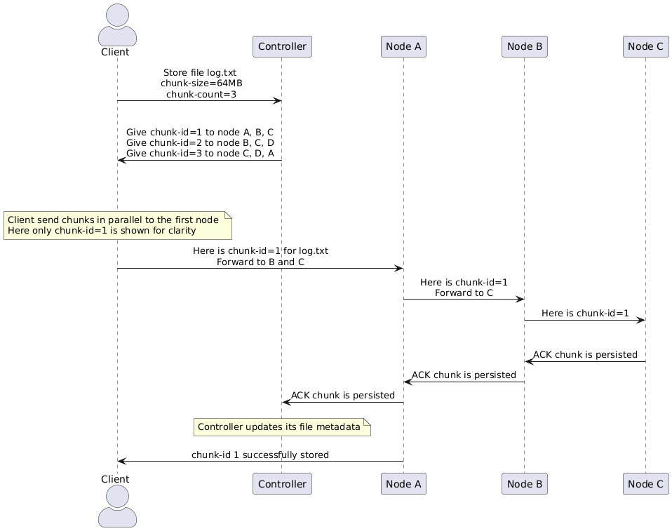

# About
This project is an implementation of a Hadoop-style distributed system with Controller, Storage, and Client as components.

# Table of Contents
- [How to run the system](#how-to-run)
- [Flow diagrams](#design-flow)
- [Some test cases](#testing-on-orion)
- [Retrospective questions](#retrospective-questions)

# How to run
1. SSH to `orion01`
2. Pull the repo if you haven't and `cd` into the project directory
3. Start the Controller and Storage nodes (this will build binaries)
    ```bash
    make start-orion
    ```
4. On a different terminal, you can the watch the logs
    ```bash
    make logs-orion
    ```
5. On another terminal, you can start the Client
    ```bash
    # List files
    ./bin/client --config config.orion.json list

    # List nodes
    ./bin/client --config config.orion.json nodes

    # Store file
    ./bin/client --config config.orion.json store --file test.txt

    # Retrieve file
    ./bin/client --config config.orion.json retrieve --file test.txt

    # Delete file
    ./bin/client --config config.orion.json delete --file test.txt
    ```

6. Stop the Controller & Storage nodes
    ```bash
    # Stop all components
    make stop-orion

    # Stop all components and clean the directory
    make clean-orion
    ```

# Retrospective Questions
1. I used 8 extra days to complete the project.

2. I could maybe: 
    - Use gRPC for communication so there is less manual connection handling and message-type checking.
    - Persisting the Controller state is a recurring issue, so something like a small metadata store can make recovery/restart durable.

3. Areas for improvements:
    - Controller prevents conflicts at the metadata level, but the Storage node itself doesn't protect same-chunk file access. I could add synchronization per chunk to prevent concurrent retrieve and delete.
    - Client retrieves file by buffering chunks in memory. It could write the chunks directly to the output file, given that the Client knows the file size and chunk size. This is scalable to large files.
    - Controller snapshot can be enhanced by including pending files and occasionally cleaning up stale files.

4. I would say around 20-30 hours. Testing took the most time. Handling edge cases (e.g. re-replication when a node failed) and defining the protobuf messages come in second place.

5. I learned that keeping state consistent in a distributed system is a difficult problem. Nothing, I think the project is good, though the project specification could be made more detailed.

# Design Flow

## Store flow


1. Client sends `StoreRequest` to the Controller with: filename, chunk size, chunk count, file size.
2. Controller checks if the file already exists in either: completed files or pending files (currently being stored).
3. If the file is new, the Controller does the following:
    - picks replica destinations for each chunk
    - records the file in `pendingFiles` map
    - records the intended chunk holders in `pendingStores` map
    - returns `StoreResponse` to the Client with the <chunk to node> mappings
4. Client splits the file into chunks and sends each chunk in parallel to the first node in that chunk’s pipeline.
5. The first storage node then:
    - verifies the checksum
    - persists the chunk and checksum sidecar on disk
    - records the chunk in `newChunks` for heartbeat confirmation to Controller
    - forwards the same chunk to the next node in the pipeline
6. Each downstream replica does the same thing until the last replica has stored the chunk.
7. Storage acknowledgements (ACK) travels back up the pipeline to the first replica, which then replies to the client.
8. Storage nodes report successful local writes to the Controller through the `new_chunks` field in its heartbeat.
9. Controller confirms those replicas and moves the file from pending status to completed files. This happens only after the chunk has enough confirmed replicas.

## Retrieve flow

1. Client sends `RetrieveRequest` to Controller with the filename.
2. Controller checks if the file is completed or is still pending.
3. If the file is complete, Controller returns `RetrieveResponse` with <chunk to node> mappings for the requested file. Each chunk's replica list is included for the Client to forward to the Storage.
4. Client fetches chunks in parallel. For each chunk, it contacts one storage node first and includes the other replica nodes.
5. The contacted storage then:
    - verifies its local chunk against the checksum sidecar
    - if valid, returns the chunk immediately
    - if corrupted or missing, it tries to repair from replica nodes
    - repairs its local copy, then returns the chunk
6. Client stores each fetched chunk in memory at the correct chunk index.
7. After all chunk fetches succeed, the client reassembles the file and writes the final output.

## Delete flow

1. Client sends `DeleteRequest` to the Controller with the filename.
2. Controller checks if the file exists in either completed or pending files.
3. If the file exists, the Controller finds all nodes that may hold the file’s chunks.
4. Controller issues a `DeleteChunkRequest` to relevant nodes.
5. Each node deletes the chunk and its checksum.
6. Controller returns success to the client

## Replication flow


1. The Controller manages two replication-tracking structures:
    - `pendingReplications`: replication requests that have been queued and will be sent to destination nodes on the next heartbeat response.
    - `inFlightReplications`: chunk replications that have already been assigned to a destination node but have not yet been confirmed. This includes both:
        - requests still waiting in `pendingReplications`
        - requests that were already sent, but the destination node has not yet acknowledged success
2. Every 5 seconds, the Controller checks whether storage nodes are still alive by tracking incoming `Heartbeat` messages.
    - If a node has not been seen within `HeartbeatTimeout` (15 seconds), the Controller marks it as failed.
    - At that point, the Controller:
        - removes the failed node from the live node set
        - re-queues any unconfirmed replications that were assigned to that failed node as a destination
        - handles the failed node’s confirmed chunk replicas by scheduling re-replication for both completed files and pending files
3. To handle node failure, the Controller:
    - finds all affected chunks in both:
        - completed files whose confirmed replica list included the failed node
        - pending files whose confirmed replica list or pending store assignments included the failed node
    - for each affected chunk, queues replication:
        - removes the failed node from the chunk’s confirmed replica list
        - checks whether the chunk already has an assigned-but-unconfirmed replication in `inFlightReplications`
        - if so, it does not issue another replication request
        - otherwise, it:
            - picks a source node from the surviving confirmed replicas
            - picks a destination node that doesn't already hold a confirmed copy OR have an intended pending copy of the chunk
            - creates a `ReplicateRequest`
            - adds that request to `pendingReplications`
            - records the chunk in `inFlightReplications`
    - At this stage, the destination node is not yet added to the chunk’s confirmed replica list.
4. The Controller sends queued replication work during the next heartbeat cycle.
    - When a destination node sends a `Heartbeat`, the Controller responds with a `HeartbeatResponse`.
    - If there are queued replication requests for that destination node, they are piggybacked in that `HeartbeatResponse`.
    - After sending them, the requests are removed from `pendingReplications`, but they remain tracked in `inFlightReplications` until success is confirmed.
5. The destination storage node handles a ReplicateRequest as follows:
    - It first tries to fetch a verified copy of the chunk from the suggested source node.
    - If that source cannot provide a valid copy, for example because the node is down or its local replica is corrupted, the destination node asks the Controller for refreshed chunk holders using `ChunkLocationsRequest`.
    - It then tries candidate replicas one at a time using RepairChunkRequest.
    - Once it gets a valid copy, it writes: the chunk file & the recomputed checksum sidecar.
    - It then records the chunk in newChunks, so the next Heartbeat will report that it now holds the chunk.
6. The destination storage node acknowledges successful replication indirectly through its next `Heartbeat`. The `Heartbeat` includes the replicated chunk in `new_chunks` field.
7. In `handleHeartbeat()`, the Controller processes these reported chunks:
    - If the reporting node was the expected destination for an unconfirmed replication of that chunk, the Controller:
        - adds the node to the chunk’s confirmed replica list
        - clears the corresponding entry in inFlightReplications
    - This is the point where replication becomes confirmed in controller metadata.
8. If a destination node fails before confirming replication:
    - the failure detector removes it from the live node set
    - any unconfirmed replications assigned to that node are removed from `inFlightReplications`
    - those chunks can then be queued again for replication to a different destination node

## Corruption Detection flow


1. Client sends `RetrieveRequest` to the Controller with the filename.
2. Controller sends a list of chunks + nodes that have a copy of each chunk (`RetrieveResponse`)
3. Client fetches chunks in parallel. For each chunk, it sends `RetrieveChunkRequest` to one storage node. The request includes:
    - `ChunkInfo` (`filename`, `chunk_index`)
    - `replica_hints`, which are the other nodes known to hold replicas of that chunk
4. The contacted storage node verifies its local chunk against the checksum sidecar stored on disk.
    - If the local copy is valid, it returns the chunk immediately.
    - If the local copy is corrupted, it tries to repair using the nodes in `replica_hints`.
    - If those hints fail, for example because nodes are down or the list is stale, it sends `ChunkLocationsRequest` to the Controller to get a refreshed list of holders for that chunk.
    - The storage node then sends `RepairChunkRequest` to candidate replicas one at a time.
    - A replica that receives `RepairChunkRequest` only checks its own local chunk against its own local checksum.
    - If valid, it returns the chunk in `RepairChunkResponse`.
    - If invalid or missing, it returns failure immediately.
    - Importantly, a replica does not start another repair attempt from inside `RepairChunkRequest`, because that would create repair chains or loops, make latency unpredictable, and allow one client read to trigger a cascade of cross-node recovery work.
5. Once the original storage node gets a valid chunk from a replica, it overwrites its corrupted local copy and recomputes the checksum sidecar.
6. The storage node then returns the repaired chunk to the client.


# Testing on Orion

## Corruption Detection Test
Corruption test file is located in `orion01` under `/bigdata/students/aawihardja/datasets/corruption.txt`

```bash
# SSH to orion01

# Cleanup
make clean-orion

make start-orion

# In a second terminal ssh to orion01 and view the logs
make logs-orion

# In a third terminal, ssh to orion01, start the Client, and store the test file
./bin/client --config config.orion.json store --file /bigdata/students/aawihardja/datasets/corruption.txt --chunk-size 1048576

# Find primary replica from Controller snapshot
cat /bigdata/students/aawihardja/controller_snapshot.json

# In a fourth terminal, ssh to the replica host shown in the snapshot and change
# the file content without changing the checksum sidecar
printf 'hahahaha\n' > /bigdata/students/aawihardja/storage/$PRIMARY_HOST/node_${PORT}/corruption.txt_chunk_0

# In the Client terminal, retrieve the file (this will trigger recovery)
./bin/client --config config.orion.json retrieve --file corruption.txt

# Delete the file from the dfs
./bin/client --config config.orion.json delete --file corruption.txt

# Delete retrieved file
rm /bigdata/students/aawihardja/downloads/corruption.txt
```

## Re-replication Test
Replication test file is located in `orion01` under `/bigdata/students/aawihardja/datasets/repl-test.txt`

```bash
# SSH to orion01

# Start Controller + Storage
make start-orion

# In a 2nd terminal, ssh to orion01 and watch the logs
make logs-orion

# In a 3rd terminal, ssh to orion01, start the Client, and store test file
./bin/client --config config.orion.json store --file /bigdata/students/aawihardja/repl-test.txt

# Find which nodes hold the replica from Controller snapshot (in orion01)
cat /bigdata/students/aawihardja/controller_snapshot.json

# SSH to one of the replica (e.g. orion06) and stop the storage process
# kill $(cat /bigdata/students/aawihardja/pids/storage_${HOST}_${PORT}$.pid)
kill $(cat /bigdata/students/aawihardja/pids/storage_orion09.cs.usfca.edu_10000.pid)

# This will trigger re-replication, wait for about 30 seconds for the Controller to detect failure

# Check the logs in the 2nd terminal, there should be something like:
[Controller] Node 8 (orion09.cs.usfca.edu:10000) timed out, marking dead
[Controller] Node orion09.cs.usfca.edu:10000 failed, 1 chunks affected
[Controller] Chunk repl-test.txt[0] now has 2 replicas, needs re-replication
[Controller] Queued replication for repl-test.txt[0]: src=orion07.cs.usfca.edu:10000 dest=Node 7 (orion08.cs.usfca.edu:10000)

# On orion01, check the Controller snapshot, there should be a new Storage that now holds the replica.
# Check if that new node has the chunk + checksum
```